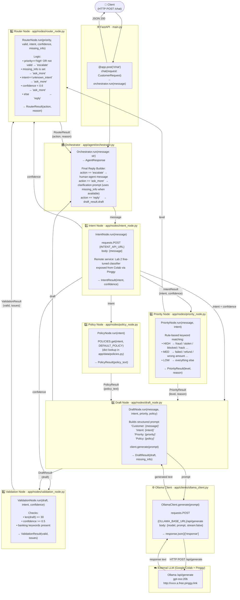
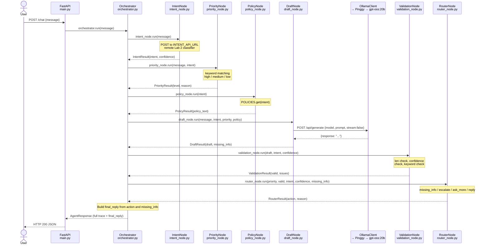
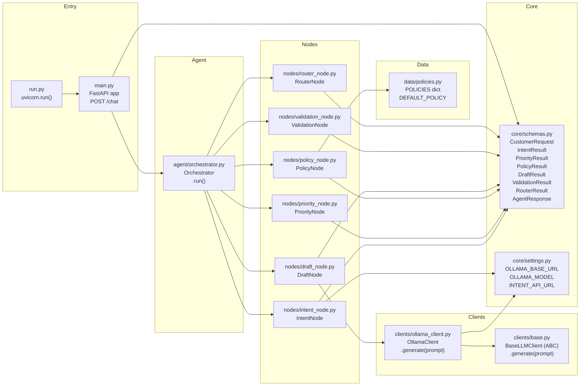

# Banking AI Agent

> **Project 3 — Applications of Natural Language Processing in Industry**
> University of Science, VNU-HCM · Faculty of Information Technology

---

## Objective

This project implements a simple **AI agentic pipeline** for automated customer support in the banking domain. The system receives a customer message, detects the banking intent using a fine-tuned model (from Project 2), retrieves relevant policy information, drafts a response using Ollama, validates it, and decides whether to reply automatically or escalate to a human agent.

---

## System Architecture

### Node & Data-Flow Diagram



---

###  Call-Flow Sequence Diagram



---

###  Module Dependency Map



---

## Node Reference

| # | Node | File | Method signature | Inputs | Output schema |
|---|------|------|-----------------|--------|---------------|
| 1 | **Intent** | `nodes/intent_node.py` | `IntentNode.run(message)` | raw text | `IntentResult(intent, confidence)` |
| 2 | **Priority** | `nodes/priority_node.py` | `PriorityNode.run(message, intent)` | text + intent label | `PriorityResult(level, reason)` |
| 3 | **Policy** | `nodes/policy_node.py` | `PolicyNode.run(intent)` | intent label | `PolicyResult(policy_text)` |
| 4 | **Draft** | `nodes/draft_node.py` | `DraftNode.run(message, intent, priority, policy)` | text + intent + level + policy | `DraftResult(draft, missing_info)` |
| 5 | **Validation** | `nodes/validation_node.py` | `ValidationNode.run(draft, intent, confidence)` | draft text + confidence | `ValidationResult(valid, issues)` |
| 6 | **Router** | `nodes/router_node.py` | `RouterNode.run(priority, valid, intent, confidence, missing_info)` | level + bool + intent + confidence + draft hints | `RouterResult(action, reason)` |

### Router decision logic

```
priority == "high"  OR  valid == False  →  action = "escalate"
missing_info is not None                 →  action = "ask_more"
intent == "unknown_intent"               →  action = "ask_more"
confidence < 0.6                          →  action = "ask_more"
otherwise                                 →  action = "reply"
```

---

## Project Structure

```
banking-ai-agent/
├── app/
│   ├── main.py                       # FastAPI app  (POST /chat, GET /health)
│   ├── agent/
│   │   └── orchestrator.py           # Main pipeline controller (Orchestrator.run)
│   ├── clients/
│   │   ├── base.py                   # Abstract LLM client (BaseLLMClient)
│   │   └── ollama_client.py          # Ollama HTTP client (OllamaClient.generate)
│   ├── core/
│   │   ├── schemas.py                # Pydantic I/O schemas for all nodes
│   │   └── settings.py               # OLLAMA_BASE_URL, OLLAMA_MODEL, INTENT_API_URL
│   ├── data/
│   │   └── policies.py               # BankingPolicies class + POLICIES dict + DEFAULT_POLICY
│   └── nodes/
│       ├── intent_node.py            # IntentNode  — remote Lab 2 classifier API
│       ├── priority_node.py          # PriorityNode — keyword rule engine
│       ├── policy_node.py            # PolicyNode  — delegates to BankingPolicies
│       ├── draft_node.py             # DraftNode   — Ollama prompt + generate
│       ├── validation_node.py        # ValidationNode — rule checks
│       └── router_node.py            # RouterNode  — escalation logic
├── examples/
│   └── sample_requests.json          # Test cases
├── run.py                            # Entry point  (uvicorn → app.main:app, port 6636)
├── requirements.txt
└── README.md
```

---

## ⚙️ Installation & Setup

### 1. Clone and install

```bash
git clone https://github.com/<your-username>/banking-ai-agent.git
cd banking-ai-agent
```

### 2. Create a virtual environment and install dependencies

```bash
pip install -r requirements.txt
```

### 3. Start Ollama and the intent classifier on Google Colab

Open `Ollama-Pinggy.ipynb` in Google Colab and run the Ollama cells plus the Lab 2 intent classifier cells. The notebook starts two local services:

| Service | Local port | Purpose |
|---------|------------|---------|
| Ollama | `11434` | Draft response generation with `gpt-oss:20b` |
| Intent classifier | `8000` | Lab 2 fine-tuned intent prediction at `/predict` |

### 4. Expose both services with Pinggy

Create one Pinggy tunnel for Ollama and a second Pinggy tunnel for the intent classifier:

```bash
ssh -p 443 -R0:localhost:11434 qr@a.pinggy.io
ssh -p 443 -R0:localhost:8000 qr@a.pinggy.io
```

Copy both generated public URLs into `app/core/settings.py`. The app reads them through the `Settings` class, so these defaults can also be overridden from a local `.env` file.

```python
OLLAMA_BASE_URL = "http://xxxx.a.free.pinggy.link"
OLLAMA_MODEL    = "gpt-oss:20b"
INTENT_API_URL  = "http://yyyy.a.free.pinggy.link/predict"
```

Optional `.env` override:

```bash
OLLAMA_BASE_URL=http://xxxx.a.free.pinggy.link
OLLAMA_MODEL=gpt-oss:20b
INTENT_API_URL=http://yyyy.a.free.pinggy.link/predict
```

### 5. Run the server

```bash
python run.py
```

Server starts at `http://localhost:6636` — interactive docs at `http://localhost:6636/docs`.

---

## API Endpoints

| Method | Path | Description |
|--------|------|-------------|
| `POST` | `/chat` | Process a customer message, returns full pipeline trace + final reply |
| `GET` | `/health` | Health check |

### Example request

```bash
curl -X POST http://localhost:6636/chat \
  -H "Content-Type: application/json" \
  -d '{"message": "I made a transfer 3 days ago but the recipient has not received the money."}'
```

### Sample requests

See [`examples/sample_requests.json`](examples/sample_requests.json) for test cases covering:

| Message | Detected intent | Priority | Routing |
|---------|----------------|----------|---------|
| Transfer with TXN/date provided | `transfer_not_received_by_recipient` | `low` | `ask_more` |
| Card blocked after OTP check | `declined_card_payment` | `high` | `escalate` |
| Unauthorized card payment with amount/reference | `card_payment_not_recognised` | `high` | `escalate` |
| Refund with order/return date provided | `Refund_not_showing_up` | `medium` | `reply` |
| Balance question in app | `balance_not_updated_after_bank_transfer` | `low` | `reply` |
| Unclear beeping issue | `unknown_intent` | `low` | `ask_more` |

---

## Testing & Demo Results

### Routing Outcomes

The system successfully demonstrates all three routing decisions:

#### 1. Auto-Reply
- **Case:** "I returned the product on 2026-05-02 and my refund for order 771245 still has not shown up in my account."
- **Intent detected:** `Refund_not_showing_up`
- **Priority:** `medium` → **Action:** `reply`
- **Output:** returns the drafted banking response as the final reply

- **Case:** "How do I check my account balance in the mobile app?"
- **Intent detected:** `balance_not_updated_after_bank_transfer`
- **Priority:** `low` → **Action:** `reply`

#### 2. Escalation
- **Case:** "My card was blocked after an OTP check, and I need help reactivating it to make a payment today."
- **Intent detected:** `declined_card_payment`
- **Priority:** `high` → **Action:** `escalate`

- **Case:** "Someone made an unauthorized card payment of $79.40 on my account ending 4432 yesterday."
- **Intent detected:** `card_payment_not_recognised`
- **Priority:** `high` → **Action:** `escalate`

#### 3. Ask More
- **Case:** "I made transfer TXN-48291 on 2026-05-05 for $250 to account 009182, but the recipient still has not received it."
- **Intent detected:** `transfer_not_received_by_recipient`
- **Priority:** `low` → **Action:** `ask_more`
- **Final reply:** asks for the specific missing details extracted from the draft

- **Case:** "My grandmother's debit card was linked to the app, but the card link keeps failing with an error code."
- **Intent detected:** `unknown_intent`
- **Priority:** `low` → **Action:** `ask_more`

All responses include the complete pipeline trace: `intent`, `priority`, `policy`, `draft`, `validation`, `routing`, and `final_reply`.

---

## Video Demo

**Demo URL:** [Insert your video link here]

### Recording Checklist

- [ ] Start the notebook on Kaggle,, explain that it runs both Ollama and Intent classifier and must use Kaggle 2T4 GPU for sufficient VRAM
- [ ] Start the server: `python run.py`
- [ ] Open Swagger UI at `http://localhost:6636/docs`
- [ ] Send 3–5 sample messages from `examples/sample_requests.json`
- [ ] Show the full JSON response for at least one auto-reply case
- [ ] Show an escalation case and its response
- [ ] Show the three routing decisions (reply, escalate, ask_more)
- [ ] Walk through one complete node trace (intent → priority → policy → draft → validation → routing)
**Video should cover:** System overview, architecture, sample inputs/outputs, and the three routing outcomes. Could show the Readme file

---

## Authors

| Student ID | Full Name |
|-----------|-----------|
| 23120371 | Lê Trung Tín |
